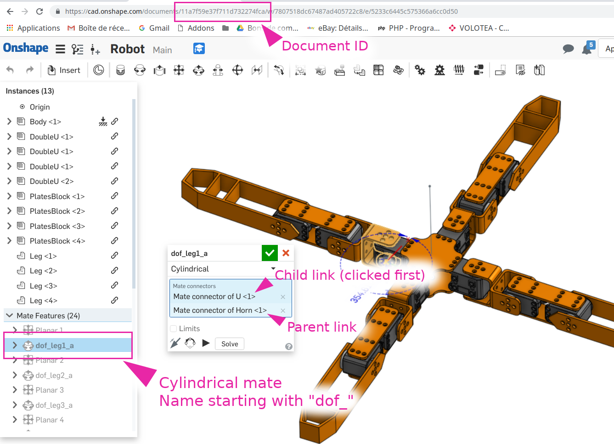

# OnShape to SDF/URDF importer

This tool is based on the [OnShape API](https://dev-portal.onshape.com/) to retrieve
informations from an assembly and build an SDF or URDF model suitable for physics
simulation.

## Design-time considerations

There is some design constraints:

* Try to make your robot assembly mostly based on sub pre-assembled components (avoid to have a lot of constraints that are not relevant for the export)
* Degree of freedoms should be cylindrical mate connectors named `dof_something`, where `something` will be used to name the joint in the final document
* When doing this connection, click the children joint first. This will be used to find the trunk of the robot (part with children but no parent)

## Requirements

First clone this repository:

    git clone git@github.com:Gregwar/onshape-urdf.git

Install the dependencies (can be in your python3 virtualenv):

    pip install numpy pybullet requests

You might also need OpenSCAD for pure shape estimation

    apt-get install openscad

## Configuration

Create your own robot configuration by copying the `robots/skeleton` directory
to your own:

    cp -R robots/skeleton/ robots/myrobot

Then edit `config.json` in your repository, here are the entries:

* `onshape_api`: URL for OnShape API
* `onshape_access_key` and `onshape_secret_key` are the API key you obtained
  from [OnShape developper portal](https://dev-portal.onshape.com/keys)
* `documentId` is the document ID to be imported (see above picture)
* `outputFormat` can be `sdf` or `urdf`
* `drawFrames` if you want the frames to be drawn
* `drawCollisions` if you want the elements from collisions to be also put
  in visuals instead of meshes (can be used to debug pure shapes)
* `useScads` if you want or not to use scad files for pure shapes (see below)
* Optionnaly, `assemblyName` can be used to specify the name of the assembly. Else
  the first assembly found in document will be used.

## Running the import

You can run the import using:

    ./run-import.py robots/myrobot

## Running the simulation

### PyBullet

To run the simulation:

    ./bullet.py robots/myrobot

### Gazebo

You can give a try to gazebo using:

    gazebo
    gz model -m robot -d
    gz model --spawn-file=robot.sdf --model-name=robot

## Pure shapes

By default, meshes are also used for collision. This is versatile but is computationally
expensive, and can be numerically instable.

You can approximate those parts with pure shapes (namely boxes, spheres and cylinders).
For this, we propose a solution based on `openscad`:

    apt-get install openscad

To do that, you need to create a `.scad` file next to `.stl` one. For instance `motor.scad`
that will approximate `motor.stl` file.

You can use `./edit-shape.py [stl-file]` that will automatically prepare and run the `.scad`
using a template visualizing the `.stl` with transparency, allowing you to edit the pure
shapes related:

Then, the pure shapes from your scad will be used when generating the `sdf` or `urdf` file (next
time you will run `run-import.py`, it will read your `.scad` files).

Thus, if the `.scad` file is empty, your part will have no collision. If you want to use the mesh
again, simply remove the `.scad` file.

## Frames

If you want to track some frames on your robot, you can do the following:

* Connect any part to your robot using mate relations in OnShape
* Name one of these relations `frame_something`, when `something` will be the name of
  the frame (a link) in the resulting `sdf` or `urdf`

