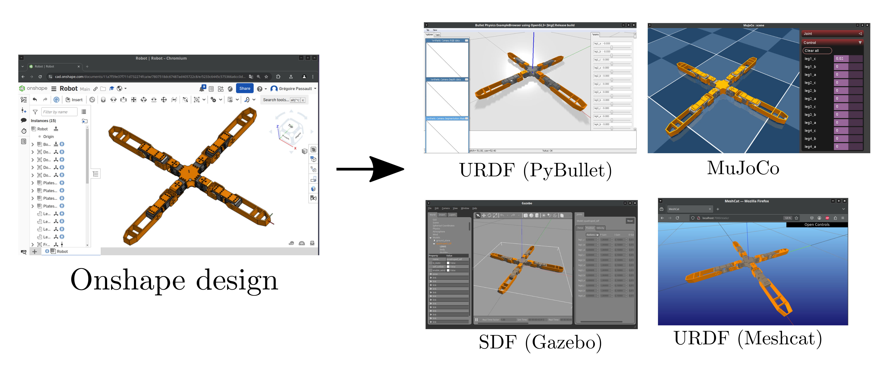

# Onshape to Robot (URDF, SDF, MuJoCo)

This tool is based on the [Onshape API](https://dev-portal.onshape.com/) to retrieve
informations from an assembly and build a robot description (URDF, SDF, MuJoCo ) suitable
for physics simulation.

* [Documentation](https://onshape-to-robot.readthedocs.io/)
* [Examples](https://github.com/rhoban/onshape-to-robot-examples)
