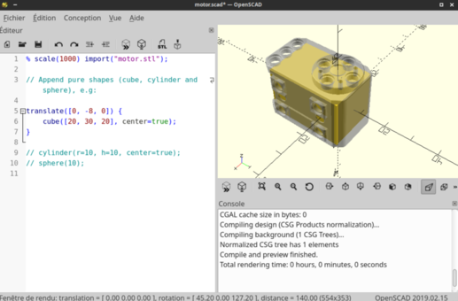
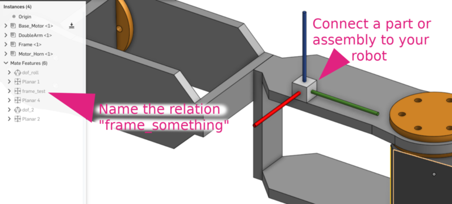

# OnShape to Robot (SDF/URDF)

<p align="center">

</p>

This tool is based on the [OnShape API](https://dev-portal.onshape.com/) to retrieve
informations from an assembly and build an SDF or URDF model suitable for physics
simulation.

## Design-time considerations

There is some design constraints:

* Try to make your robot assembly mostly based on sub pre-assembled components (avoid to have a lot of constraints that are not relevant for the export). In this main assembly, do not use features such as sub-assemblies network.
* Degree of freedoms should be slider, cylindrical or revolute mate connectors named `dof_something`, where `something` will be used to name the joint in the final document
    * If the mate connector is *cylindrical* or *revolute*, a `revolute` joint will be issued
    * If the mate connector is a *slider*, a `prismatic` joint will be issued
    * If the mate connector is *fastened*, a `floating` joint will be issued
* When doing this connection, click the children joint first. This will be used to find the trunk of the robot (part with children but no parent)

<p align="center">

</p>

It is possible to invert the axis for convenience by adding `_inv` at the end of the name. For instance
`dof_head_pitch_inv` will result in a joint named `head_pitch` having the axis inverted with the one
from the OnShape assembly.

## Onshape-to-robot commands

Onshape-to-robot provide the following commands:

* `onshape-to-robot`: the main script that run the robot import (given a directory containing a `config.json` file,
  see below)
* `onshape-to-robot-edit-shape`: a tool that runs OpenSCAD with proper configuration to allow you editing the pure
  shape approximation of some mesh manually
* `onshape-to-robot-bullet`: simple test that can run your robot in a simulation once it's imported. Pass `-f` to make
  the base of your robot fixed (if it is a robotic arm for example). If a joint name ends with `_speed`, it will control
  it with speed instead of position.
* `onshape-to-robot-clear-cache`: clearing the cache of API requests (used to speed up re-runs)


## Installation & requirements

### From pip

Run the following to install [onshape-to-robot from pypi](https://pypi.org/project/onshape-to-robot/):

    pip install onshape-to-robot

### From the repository

First clone this repository:

    git clone git@github.com:Rhoban/onshape-to-robot.git

Install the dependencies (can be in your python3 virtualenv):

    pip install numpy pybullet requests commentjson colorama numpy-stl

### Optional requirement

You might also need OpenSCAD for pure shape estimation

    apt-get install openscad

And Meshlab for STLs simplifications

    apt-get install meshlab

## Setting up your API key

To go any further, you will need to obtain API key and secret from the
[OnShape developer portal](https://dev-portal.onshape.com/keys)

We recommend you to store your API key and secret in environment variables, you can add something
like this in your `.bashrc`:

```bash
// Obtained at https://dev-portal.onshape.com/keys
export ONSHAPE_API=https://cad.onshape.com
export ONSHAPE_ACCESS_KEY=Your_Access_Key
export ONSHAPE_SECRET_KEY=Your_Secret_Key
```

Alternatively, those keys can be stored in the `config.json` file, that will override those
parameters (see below). It is however preferred to use environment variables because you can then
share safely your `config.json` without sharing your secret keys.

## Export your own robot

To export your own robot, first create a directory:

    mkdir my-robot

Then edit `my-robot/config.json`, here is the minimum example:

```json
{
    "documentId": "your-document-id",
    "outputFormat": "urdf"
}
```

Here, we just specify the document id (see picture above) and the output format. You can now run the
`onshape-ro-robot my-robot` command, that will start the import.

Here is the full list of possible entries for this configuration.

* `onshape_api`: URL for OnShape API
* `onshape_access_key` and `onshape_secret_key` are the API key you obtained
  from [OnShape developer portal](https://dev-portal.onshape.com/keys)
* **WARNING: Instead of storing those sensitive keys in your `config.json` file, you
   can alternatively use the environment variables (see above)**
* `documentId` is the document ID to be imported (see above picture)
* `versionId` is the version ID to be imported (optional, can be used to "fix" a version ID), it can be
  also found in the URL, after the `/v/` part when selecting a specific version. If you don't specify any, the
  last version from your workspace will be automatically retrievied
* `outputFormat` can be `sdf` or `urdf`
* `drawFrames` if you want the frames to be drawn
* `drawCollisions` if you want the elements from collisions to be also put
  in visuals instead of meshes (can be used to debug pure shapes)
* `useScads` if you want or not to use scad files for pure shapes (see below)
* Optionally, `assemblyName` can be used to specify the name of the assembly. Else
  the first assembly found in document will be used.
* `jointMaxEffort` and `jointMaxVelocity` can be used to specify the values that will
  be used in the `joints` entry. Alternatively, they can be dictionaries associating
  joints names to values.
* The `dynamics` key can be used to override inertial data computed by OnShape for
  a specific part (see example below)
* `noDynamics` can be set to `true` if you want to have all masses and inertia to 0
  (suppose you want to create an environment)
* `ignore` can be a list of part that you want to be ignored in the URDF export
* `packageName` adds a string to the paths of stl files. This is helpful for ROS users 
  as they often need to specify their robot_description package.
* `addDummyBaseLink` adds a base_link without inertia as root. This is often necessary for ROS users
* `robotName` specifies the robot name.
* `additionalUrdfFile` specifies a file with xml content that is inserted into the URDF at the end of the file. 
  Useful to add things that can't be modelled in onshape, e.g. simulated sensors.
* `additionalSdfFile` the same but for the SDF output. The XML content is added inside the `<model>` part.
* `connectWithFixedLinks` when part is not in any joint (orphan), onshape-to-robot tries to merge it with the most
relevant part of the robot, first checking for existing mates, and then finally connecting it to the trunk. This
option defined wether it will be merged or attached to that part with a `fixed` joint.

Here is an example of configuration:

```js
{
    // You should store those three in environment variables
    "onshape_api": "https://cad.onshape.com",
    "onshape_access_key": "[KEY]",
    "onshape_secret_key": "[SECRET]",

    // Can be found in the URL when editing the assembly
    "documentId": "483c803918afc4d52e2647f0",
    // If not specified, the first assembly will be used
    "assemblyName": "robot",
    // Can be urdf or sdf
    "outputFormat": "urdf",
    // The frames parts are kept in the final file
    "drawFrames": false,
    // Collisions (pure shapes) are also used in the visual section
    "drawCollisions": false,
    // Wether or not the scan for SCAD files (pure shapes) should be done
    "useScads": true,
    // Masses, com and inertias will be zero (can be used if you import a static
    // field for example)
    "noDynamics": false,
    // Should the STLs of the same link be merged?
    "mergeSTLs": false,
    // Should we simplify STLs files?
    "simplifySTLs": false,
    // Maximum size (M) of STL files to run simplification (required meshlab)
    "maxSTLSize": 3,

    // Those can be used to configure the joint max efforts and velocity, and
    // overriden for specific joints
    "jointMaxEffort": {
        "default": 1.5,
        "head_pitch": 0.5   
    },
    "jointMaxVelocity": 22,

    // This can be used to override the dynamics of some part (suppose it's a compound
    // which dynamics is well specified)
    "dynamics": {
        "motorcase": {
            "mass": 0.5,
            "com": [0, 0.1, 0],
            "inertia": [0.1, 0, 0,
                        0, 0.1, 0,
                        0, 0, 0.1]
        },
        // "fixed" can be used to assign a null mass to the object, which makes it fixed (non-dynamics)
        "base": "fixed"
    },

    // Some parts can be totally ignored during import
    "ignore": [
        "small_screw",
        "small_nut"
    ]
}
```

## Naming links

If you create a mate connector and name it `link_something`, the link corresponding to the part
on which it is attached will be named `something` in the resulting URDF.

## Running the import

You can run the import using:

    onshape-to-robot robots/myrobot

This will produce files in the directory (next to the `config.json` file), including STLs (mesh
files) and the `sdf` or `urdf`.

## Running the simulation

### PyBullet

To run the simulation:

    onshape-to-robot-bullet robots/myrobot

You will have sliders available on the right to control the DOFs.

### Gazebo

You can give a try to gazebo using:

    gazebo
    gz model -m robot -d
    gz model --spawn-file=robot.sdf --model-name=robot

## Examples

Several examples can be found in the [examples repository](https://github.com/Rhoban/onshape-to-robot-examples)

## Pure shapes

By default, meshes are also used for collision. This is versatile but is computationally
expensive, and can be numerically instable.

You can approximate those parts with pure shapes (namely boxes, spheres and cylinders).
For this, we propose a solution based on `openscad`:

    apt-get install openscad

To do that, you need to create a `.scad` file next to `.stl` one. For instance `motor.scad`
that will approximate `motor.stl` file.

You can use `onshape-to-robot-edit-shape [stl-file]` that will automatically prepare and run the `.scad`
using a template visualizing the `.stl` with transparency, allowing you to edit the pure
shapes related:

<p align="center">

</p>

Then, the pure shapes from your scad will be used when generating the `sdf` or `urdf` file (next
time you will run `onshape-to-robot`, it will read your `.scad` files).

Thus, if the `.scad` file is empty, your part will have no collision. If you want to use the mesh
again, simply remove the `.scad` file.

If you pass `drawCollisions` to `true`, the collisions will also be used for the render, which can
be useful to debug:

<p align="center">

</p>

## Frames

If you want to track some frames on your robot, you can do the following:

* Connect any part to your robot using mate relations in OnShape
* Name one of these relations `frame_something`, when `something` will be the name of
  the frame (a link) in the resulting `sdf` or `urdf`

<p align="center">

</p>

If you want to give it a try, you can use the `onshape-to-robot-bullet` in `urdf` mode, it will output the
frames on standard output.

## Joint frames

Joint frames are positionned wherever you positionned the mate connector itself, and oriented in
the frame of the child link.

## Cache

Some requests are cached for convenience (recovery of STL, massproperties etc.). You can run
the `clear-cache.sh` script to remove all cached requests.

## License

This project is under MIT License, read the `LICENSE` file for more information
