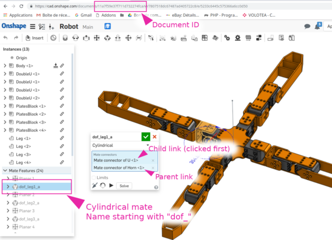
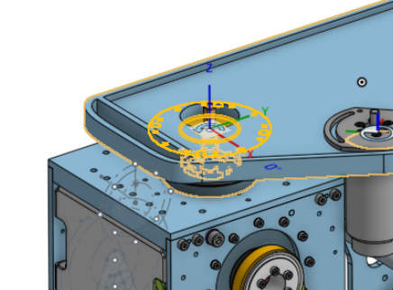

Design-time considerations
==========================

.. note::
    Try to make your robot assembly mostly based on sub pre-assembled components (avoid to have a lot of
    constraints that are not relevant for the export). In this main assembly, do not use features
    such as sub-assemblies network.

Specifying degrees of freedom
-----------------------------

* Degree of freedoms should be slider, cylindrical or revolute mate connectors named ``dof_something``, where
  ``something`` will be used to name the joint in the final document

  * If the mate connector is **cylindrical** or **revolute**, a ``revolute`` joint will be issued by default
  
    * To make a ``continuous`` joint, add ``continuous`` or ``wheel`` in the name of the joint. For instance, a **revolute** mate named
      ``dof_front_left_wheel`` will result in a ``continuous`` joint named ``front_left_wheel`` in the resulting URDF.
  * If the mate connector is a **slider**, a ``prismatic`` joint will be issued
  * If the mate connector is **fastened**, a ``fixed`` joint will be issued
* When doing this connection, click the children joint first. This will be used to find the trunk of the robot (part with children but no parent)

Inverting axis orientation
--------------------------

It is possible to invert the axis for convenience by adding ``_inv`` at the end of the name. For instance
``dof_head_pitch_inv`` will result in a joint named ``head_pitch`` having the axis inverted with the one
from the OnShape assembly.

Naming links
------------

If you create a mate connector and name it ``link_something``, the link corresponding to the part
on which it is attached will be named ``something`` in the resulting URDF.

.. _custom-frames:

Adding custom frames in your model
----------------------------------

If you want to track some frames on your robot, you can do the following:

* Connect any part to your robot using mate relations in OnShape
* Name one of these relations ``frame_something``, when ``something`` will be the name of
  the frame (a link) in the resulting ``sdf`` or ``urdf``

.. image:: _static/img/smalls/frame.png
    :align: center

If you want to give it a try, you can use the ``onshape-to-robot-bullet`` in ``urdf`` mode, it will output the
frames on standard output.

Here is a `link <https://cad.onshape.com/documents/fadc07564402eea7b8d39250/w/afe354d59e4c06d33ce690d2/e/7406c5f00136aee43a4606cb>`_ of a document that can be used as a frame (note: the center cube is 5mm side, so
you might need 2.5mm offset to center it).

Closing frames
--------------

If your robot includes closing loop, those can't be handled in the URDF file directly since the robot has to have
a kinematics structure that is a tree.

However, it is possible to add multiple frames, and to make constraints out of them during your simulation.

If you add a relation with ``closing_something`` as name, two frames will be added to your URDF
(``closing_something_1`` and ``closing_something_2``) that will be attached to the two parts mated.
It's up to you to handle it further by adding proper constraints.

Joint frames
------------

Joint frames are the ones you see in OnShape when you click on the joint in the tree on the left.
Thus, they are always revolving around the z axis, or translating along the z axis, even if the
``_inv`` suffix is added.

