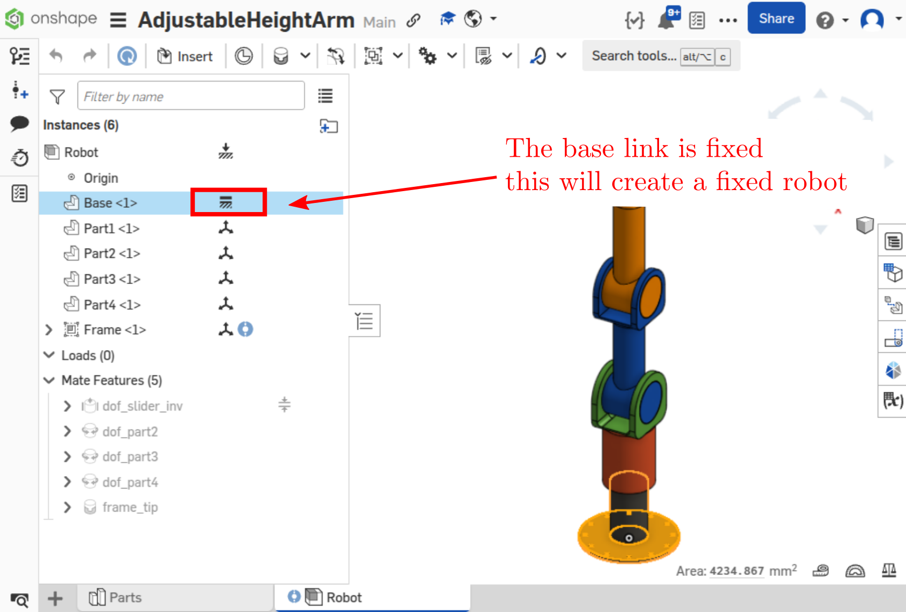

Design-time considerations
==========================

Workflow overview
-----------------

In order to make your robot possible to export, you need to follow some conventions. The summary is as follows:

* ``onshape-to-robot`` exports an **assembly** of the robot,
* Be sure this assembly is a **top-level assembly**, where instances are robot links (they can be parts or sub-assemblies),
* The **first instance** in the assembly list will be considered as the base link,
* All the instances in the assembly will become links in the export
* **Mate connectors** should have special names (see below for details):

    * ``dof_name``: for degrees of freedom
    * ``frame_name``: to create a frame (site in MuJoCo)
    * ``fix_name``: fix two links together, causing ``onshape-to-robot`` to merge them
    * ``closing_name``: to close a kinematic loop (see :ref:`kinematic-loops`)
    * Other mates are not considered by ``onshape-to-robot``

* Orphaned links (that are not part of the kinematic chain) will be **fixed to the base link**, with a warning

Specifying degrees of freedom
-----------------------------

To create a degree of freedom, you should use the ``dof_`` prefix when placing a mate connector.

* If the mate connector is **cylindrical** or **revolute**, a ``revolute`` joint will be issued 
* If the mate connector is a **slider**, a ``prismatic`` joint will be issued
* If the mate connector is **fastened**, a ``fixed`` joint will be issued

.. note::

    You can specify joint limits in Onshape, they will be understood and exported

Inverting axis orientation
--------------------------

You sometime might want your robot joint to rotate in the opposite direction than the one in the Onshape assembly.

To that end, use the ``inv`` suffix in the mate connector name. For instance, ``dof_head_pitch_inv`` will result in a joint named ``head_pitch`` having the axis inverted with the one from the Onshape assembly.

Naming links
------------

If you create a mate connector and name it ``link_something``, the link corresponding to the instance
on which it is attached will be named ``something`` in the resulting export.

.. _custom-frames:

Adding custom frames in your model
----------------------------------

You can add your own custom frames (such as the end effector or the tip of a leg) to your model.

* In URDF, it will produce a *dummy link* connected to the parent link with a fixed joint
* In SDF, a ``frame`` element will be added
* In MuJoCo, it will result in a *site*

To do so, either:

* Add a mate connector where you want your frame to be, and name it ``frame_something``, where ``something`` is the name of your frame

**OR**

* Add any relation between a body representing your frame and the body you want to attach it to. Name this relation ``frame_something``.

Here is a document that can be used (be sure to turn on "composite parts" when inserting it, use the ``frame`` composite part): `Onshape frame part <https://cad.onshape.com/documents/7adc786257f47ce24706bb32/w/774dd3de6bd5bfd65fb4462b/e/c60f72b9088ac4e5058b8904?renderMode=0&uiState=67b64076077d3a02bf5e1c0f>`_

.. note::

    The instance used for frame representation is only here for visualization purpose and is excluded from the robot.
    You can however include it by setting :ref:`draw_frames <draw-frames>` to ``true`` in the :doc:`config <config>` file, mostly for debugging purposes.

Joint frames
------------

Joint frames are the ones you see in Onshape when you click on the joint in the tree on the left.
Thus, they are always revolving around the z axis, or translating along the *z axis*.

.. image:: _static/img/zaxis.png
    :align: center

.. _fixed-robot:

Fixed robot
-----------

If you want to export a robot that is fixed to the ground, use the "Fixed" feture of Onshape:

Robot with multiple base links
------------------------------

The robot can have multiple links. In that case, the first instance appearing on the list will be considered as a separate base link.

.. note::

    MuJoCo and SDF both supports multiple base links, while URDF doesn't.

    In that case, you might consider using multiple URDF files, or :ref:`adding a dummy base link<processor_dummy_base_link>`. However, this will fix all the base links to the base link without freedom.

Gear relations
--------------

Gear relations are exported by onshape-to-robot. Be sure to click the **source joint** first, and then the **target joint**. They will be exported as ``<mimic>`` in :doc:`URDF <exporter_urdf>` and :doc:`SDF <exporter_sdf>` formats, and as equality constraints in :doc:`MuJoCo <exporter_mujoco>`.

