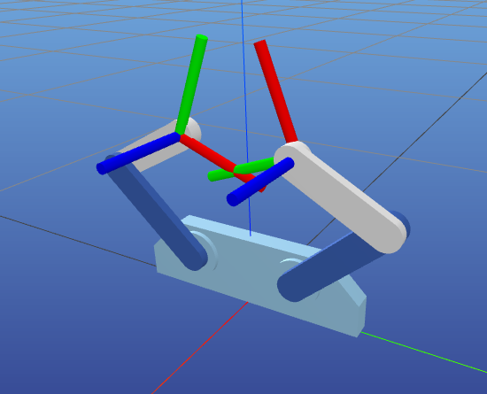
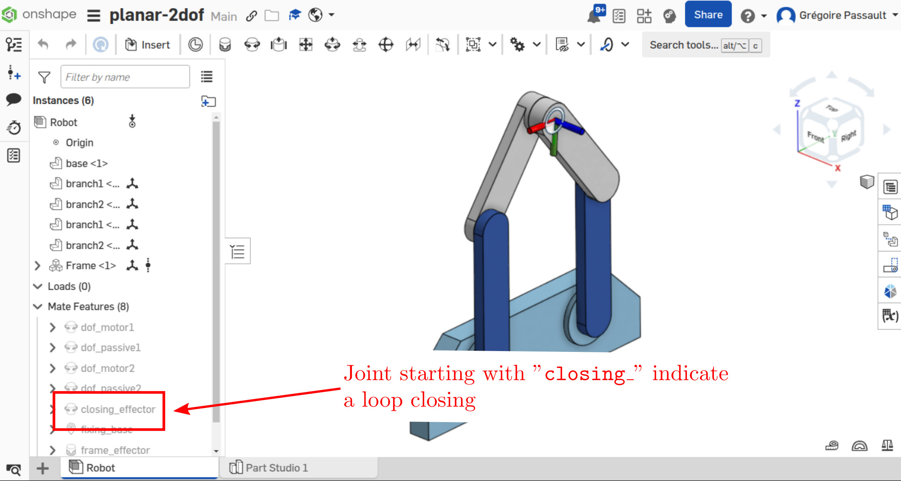

.. _kinematic-loops:

Handling kinematic loops
========================

Some robots have *kinematic loops*, meaning that the kinematic chain is not a tree but a graph.

Introduction
-------

Here is a 2D planar robot with kinematic loop, we assume the two first joints to be actuated and the others to
be passive:

.. raw:: html

    

    <video width="70%" controls>
    <source src="https://github.com/Rhoban/placo-examples/raw/master/kinematics/videos/planar_2dof_trajectory.mp4" type="video/mp4">
    </video>
    

     

However, robot description are usually **trees**. To model this type of robot, we break it down to a tree. We attach **frames** to this tree, and need to enforce **run-time constraints**.

Specifying closing constraints
---------------------

While you could manually add :ref:`frames <custom-frames>`, ``onshape-to-robot`` provides a more convenient way to handle kinematic loops: **mate connectors**.

To achieve that, add a **mate** with the name ``closing_something``:

Support for ``<equality>`` in MuJoCo
---------------------

When using the :ref:`MuJoCo <exporter-mujoco>` format, ``onshape-to-robot`` will add ``<equality>`` constraints to enforce the kinematic loop.

For example, the above robot can be exported using the following ``config.json``:

.. code-block:: javascript

    {
        // Document id, MuJoCo output
        "document_id": "04b05c47de7576f35c0e99b3",
        "output_format": "mujoco",

        // Disable the freejoint to fix the robot
        "freejoint": false,

        // Don't create actuators for passive joints
        "joint_properties": {
            "passive1": {"actuated": false},
            "passive2": {"actuated": false}
        }
    }

Here is the result of the export:

.. raw:: html

    

    <video width="70%" controls>
    <source src="https://github.com/Rhoban/onshape-to-robot-examples/raw/refs/heads/master/videos/planar_2dof_mujoco.mp4" type="video/mp4">
    </video>
    

     

Ressources
----------

Here are some ressources on how to handle kinematic loops in software:

* `Onshape assembly <https://cad.onshape.com/documents/04b05c47de7576f35c0e99b3/w/68041f3f5c827a258b40039c/e/db543f501b01adf8144064e3?renderMode=0&uiState=665d8e3a6de6705d2f788204>`_ for the above example robot.
* MuJoCo `equality <https://mujoco.readthedocs.io/en/stable/computation/index.html#coequality>`_ constraints.
* In `pyBullet <https://pybullet.org/wordpress/>`_, you can use `createConstraint` method to add the relevant constraint.
* In the `PlaCo <https://placo.readthedocs.io/>`_ solver, you can create a `RelativePositionTask`. See the `kinematics loop documentation section <https://placo.readthedocs.io/en/latest/kinematics/loop_closures.html>`_ for  more details. Some examples created with onshape-to-robot can be found in the `example gallery <https://placo.readthedocs.io/en/latest/kinematics/examples_gallery.html>`_.
