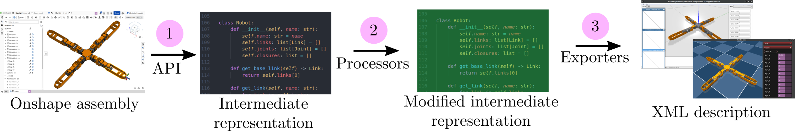

Processors
==========

Here is an overview of ``onshape-to-robot`` pipeline:

* **(1)**: The assembly is retrieved from Onshape, to produce an intermediate representation of the robot. See the `robot.py <https://github.com/Rhoban/onshape-to-robot/blob/master/onshape_to_robot/robot.py>`_ from the source code.
* **(2)**: Some operations can be applied on this representation, those are the **processors**, some of them are listed below.
* **(3)**: The robot is exported to the desired format (URDF, MuJoCo, etc.) using an **exporter**.

.. note::

    If you want to tweak your robot in the process, do not hesitate to have a look at the `export.py <https://github.com/Rhoban/onshape-to-robot/blob/master/onshape_to_robot/export.py>`_ script, which is the entry point of the ``onshape-to-robot`` command, and summarize the above-listed steps.

.. toctree::
   :maxdepth: 2
   :caption: Processors:

   processor_ball_to_euler
   processor_merge_parts
   processor_simplify_stls
   processor_scad
   processor_dummy_base_link
   processor_no_collision_meshes
   processor_collision_as_visual
   processor_convex_decomposition
   processor_fixed_links
   processor_convert_to_cameras
   custom_processors
