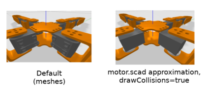

Pure shapes approximation
=========================

By default, meshes are also used for collision. This is versatile but is computationally
expensive, and can be numerically instable.

You can approximate those parts with pure shapes (namely boxes, spheres and cylinders).
For this, we propose a solution based on ``openscad``:

.. code-block:: bash

    apt-get install openscad

Approximating a mesh
--------------------

To do approximation, you need to create a ``.scad`` file next to ``.stl`` one. For instance ``motor.scad``
that will approximate ``motor.stl`` file.

You can use ``onshape-to-robot-edit-shape [stl-file]`` that will automatically prepare and run the ``.scad``
using a template visualizing the ``.stl`` with transparency, allowing you to edit the pure
shapes related:

.. image:: _static/img/smalls/pure-shape.png
    :align: center

You will then have to write manually some scad code that approximate your shape.

.. note::

    Only the union of the written shape will be used. When using ``onshape-to-robot-edit-shape``, some examples
    will appear commented. You can use ``cube``, ``sphere`` and ``cylinder``, along with ``translate`` and
    ``rotate`` to mainly do t he job. Have a look at `examples <https://github.com/Rhoban/onshape-to-robot-examples>`_
    for more insight.

Then, the pure shapes from your scad will be used when generating the ``sdf`` or ``urdf`` file (next
time you will run ``onshape-to-robot``, it will read your ``.scad`` files, assuming ``useScads`` is
not ``false``).

Part with no collision
----------------------

If the ``.scad`` file is empty, your part will have no collision.

Re-using the mesh
-----------------

To use the mesh for collision, simply remove the ``.scad`` that has the same name that the ``.stl`` file.

Drawing collisions
------------------

If you pass `drawCollisions` to `true`, the collisions will also be used for the render, which can
be useful to debug:

